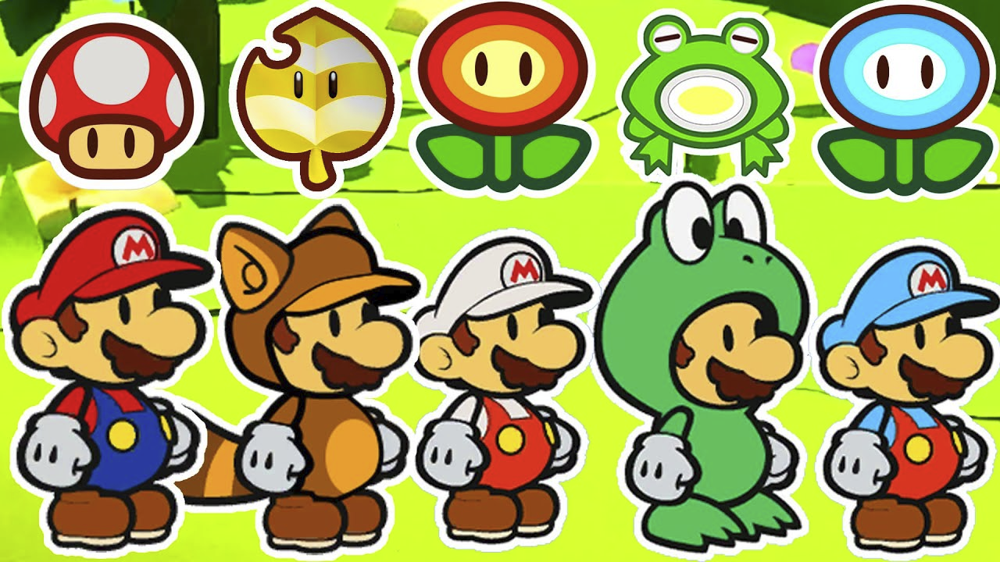

__Happy 35th Birthday Mario...__

Les équipes de Nintendo nous ont sollicités pour développer une nouvelle fonctionnalité
qu'ils souhaitent intégrer dans leur prochain jeu.
Ils voudraient qu'on puisse facilement intégrer les transformations de Mario dans le jeu.

Les transformations physiques à prendre en compte sont les suivantes :

* Définir une fabrique abstraite permettant de créer ces différentes transformations.

* Pour aller plus loin, certains items permettent à Mario de se transformer. Les transformations permettent à Mario d'acquérir
de nouveaux pouvoirs. La feuille permet à Mario de rester dans les airs en laissant le bouton de saut
appuyé, la fleur permet à Mario de lancer des boules de feu avec la touche d'action, la grenouille permet à
Mario de sauter beaucoup plus haut que d'habitude et enfin la fleur bleue permet à Mario de lancer des boules de glaces pétrifiantes.
Proposez une architecture permettant de gérer tout ceci proprement.

